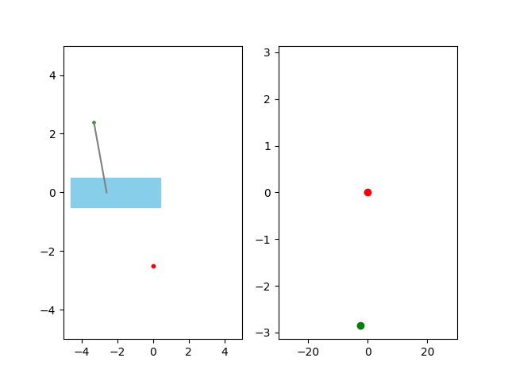
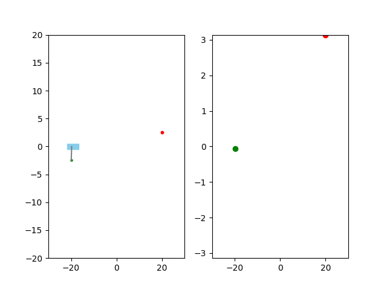

# libCEMMPC
A tiny library for CEM(cross-entropy method) based MPC(Model Predictive Control) implemented with c++ and CUDA.

## Build
```bash
cd cu_cem_mpc
mkdir build
cd build
cmake ..
```
## Visualize
There are scripts inside **scripts** folder.




